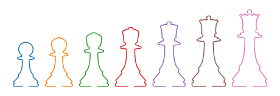

# srvpy

The `srvpy` package contains tool for numerical computations in the Square Root Velocity Framework. The package is built using `numpy` vectorization and operates with callable curves.


```python
import numpy as np
import matplotlib.pyplot as plt
from srvpy.open import HJBSolverC
from srvpy.open.samplepaths import pawn, queen

# Register the curves and compute the distance after registration
n = 1000
solver = HJBSolverC(pawn,queen,n,unit_sphere=True,normalize=True)
solver.register()
print(solver.distance()) # 0.3950

# Compute and plot the geodesics
tau = np.linspace(0,1,7)
g = solver.geodesic(tau,length='logarithmic',shift=0.2)
plt.plot(g.T.real,g.T.imag)
plt.gca().set_aspect('equal')
plt.axis('off')
plt.show()
```




The current version supports analysis of open curves with fixed rotation, including registration of curves and computation of shape space geodesics and geodesic distances. It does not support analysis of closed curves, or curves modulo rotation.
